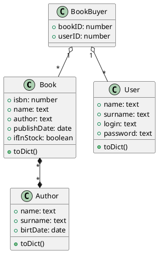

```plantuml
@startuml

class Book{
    +isbn: number
    +name: text
    +author: text
    +publishDate: date
    +ifInStock: boolean
    +toDict()
}

class User {
    +name: text
    +surname: text
    +login: text
    +password: text
    +toDict()
}

class Author{
    +name: text
    +surname: text
    +birtDate: date
    +toDict()
}

class BookBuyer{
    +bookID: number
    +userID: number
}

Book "*" *--* "*" Author
BookBuyer "1" o-- "*" User
BookBuyer "1" o-- "*" Book

@enduml
```