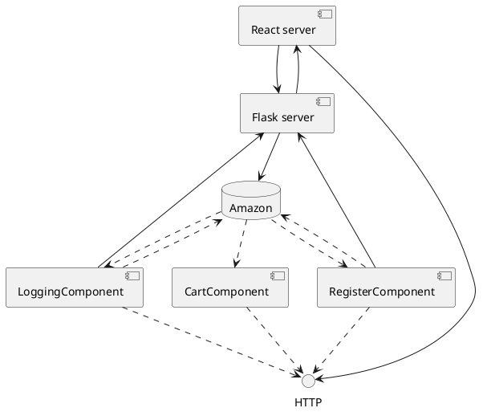

```plantuml
@startuml

[React server] as react
[Flask server] as flask
[LoggingComponent] as logging
[RegisterComponent] as register
[CartComponent] as cart

database Amazon

flask --> Amazon
react --> flask
react --> HTTP
logging ..> HTTP
register ..> HTTP
cart ..> HTTP
logging ..> Amazon
register ..> Amazon
flask --> react
Amazon ..> register
Amazon ..> logging
Amazon ..> cart
logging --> flask
register --> flask

@enduml
```