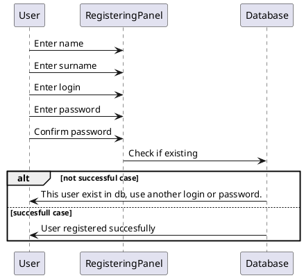

```plantuml
@startuml
participant User as u
participant RegisteringPanel as register
participant Database as db

u -> register: Enter name
u -> register: Enter surname
u -> register: Enter login
u -> register: Enter password
u -> register: Confirm password
register -> db: Check if existing

alt not successful case
    db -> u: This user exist in db, use another login or password.
else succesfull case
    db -> u: User registered succesfully
end

@enduml

```