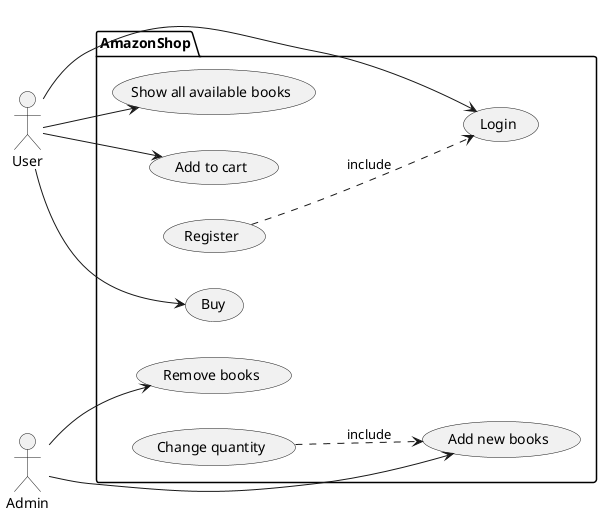

```plantuml
@startuml

left to right direction
actor User as u
actor Admin as a

package AmazonShop {
  usecase "Add to cart" as UC3
  usecase "Buy" as UC4
  usecase "Login" as UC2
  usecase "Register" as UC1
  usecase "Show all available books" as UC6
  usecase "Add new books" as UC5
  usecase "Remove books" as UC7
  usecase "Change quantity" as UC8
}

u --> UC2
u --> UC3
u --> UC4
u --> UC6

a --> UC5
a --> UC7

UC1 ..> UC2 :include
UC8 ..> UC5 :include

@enduml
```